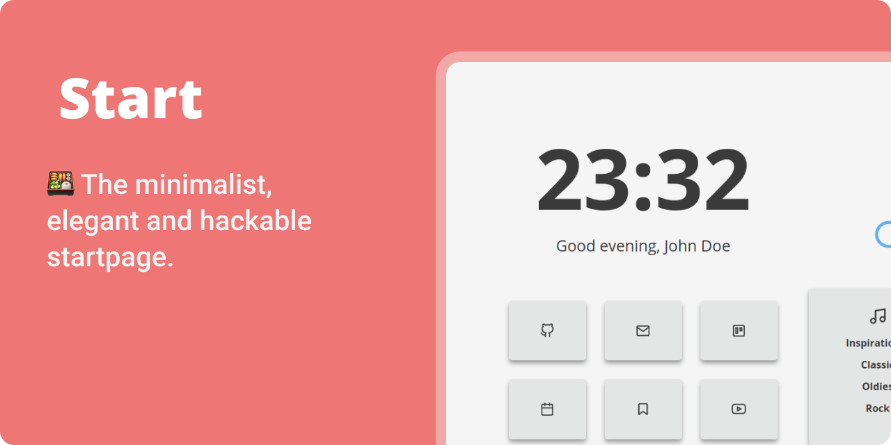

  <a href="https://mrinjamul.github.io/start/" target="_blank" style='margin-right:0px; margin-top:5px'>
    
  </a> 
</p>

<br />

## 👇 Index

- [👇 Index](#-index)
- [✨ Features:](#-features)
- [Development](#-development)

## ✨ Features:

- **Easy configuration** file.
- **Dark/Light** mode, you can toggle them and It'll be saved in local storage.
- **Clock and Date** format can be set to 24 hour (default) or 12 hour.
- **Greetings** are easy to modify.
- **Variables** for custom colors and font sizes in the `style.css` code.
- **Icons** all icons are from Feather Icons (Some others I made them with the Feather icons as a base)
- **Modular** javascript files for an easy read.

### 👨‍💻 Development

required packages (Optional),

```
# Install simple-web-server
wget https://github.com/mrinjamul/simple-web-server/releases/download/v1.1.2/sws-v1.1.2-linux-amd64
mv sws-v1.1.2-linux-amd64 sws
chmod +x sws
sudo mv sws /usr/local/bin # or to any PATH env
# Install prettier
npm install prettier
```

Note: only required if you want to use npm script commands.


